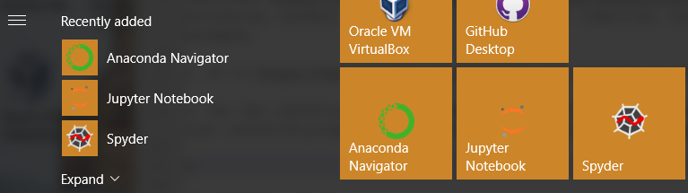

# Installation Instructions for Windows

The following instructions will *not* use a Docker image, but rather enable you to install the necessary components locally onto your machine.

## Installing Anaconda

[Anaconda](https://en.wikipedia.org/wiki/Anaconda_(Python_distribution)) is a freemium open source distribution of the Python and R programming languages for large-scale data processing, predictive analytics, and scientific computing, that aims to simplify package management and deployment. It will also enable us in install TensorFlow and other packages.

1. Go to https://www.anaconda.com/download/ and download the Windows installer. (Note: Choose the most recent version of Python unless you have a specific reason not to.)

2. Run the installer. This can take a while (5-15 minutes). There are a lot of files. (Note: Near the end a Command window will open. This is normal.) Once you're done, in your installed programs you should, among other things, have Anaconda Navigator, Jupyter Notebook and Spyder.



3. To make sure that everything is up to date, which is almost never the case, even with a fresh install, open the Anaconda Prompt, which is an application that will be found in the new Anaconda folder. (Note: The Anaconda Prompt is just like the Command Prompt, however, it ensures that you are able to run Anaconda and Conda commands without having to change directory.) Run `conda update conda` and then `conda update --all`. For both of these, when requested to proceed, enter "y". (Note: The 2nd command should include an update of conda, however, it's been noted that doing these in two steps can sometimes avoid some crashing.)

`conda list` will give you a list of everything installed along with the version numbers.

## Installing TensorFlow

The [instructions](https://www.tensorflow.org/install/install_windows) for installing TensorFlow immediately point to two options: with CPU support only or with GPU support. The latter will give you better performance, but it's significantly more complicated and will require installing a lot of NVIDIA stuff, some of which requires approval for a NVIDIA developer account. That may take days, so let's go with CPU support only. (Note: If you'd like to try to install with GPU support you should go for it because it is awesome. Once all the NVIDIA stuff is in place, you'll have to make one small change below, which is `pip install --ignore-installed --upgrade tensorflow-gpu`. You can always come back and do this later, too.)

1. Create a Conda environment named "tensorflow" by running `conda create -n tensorflow` in the Anaconda Prompt. Reply "y" at the prompt asking to proceed. (Note: This will, by default, include the version of Python installed.)

2. Activate the environment by running `activate tensorflow`. (Note: Your prompt should change to something like `(tensorflow) C:>`.)

3. To install the CPU only version of TensorFlow into the environment, run `pip install --ignore-installed --upgrade tensorflow`. (Note: If you run `conda list` and see that "tensorflow" is already there, then it came preinstalled with your Anaconda. Reinstalling it won't hurt, but this step might be superfluous.)

If you get a pop-up windows that says, "Missing shortcut: Windows is searching for python.exe," you can click the button to tell Windows where to find it (saving you a ton of time) and then navigate to `C:\Users\{your-user-name}\Anaconda3`. python.exe should be in there.

## Test your Installation in Jupyter Notebook

You should now be ready to give it a whirl.

1. From the Anaconda Prompt, *inside your "tensorflow" environment*, run `jupyter notebook` and your default browser should open to `http://localhost:8888/tree` with the Jupyter logo at the top.

2. Create a new kernel by clicking the **New** button on the top right and selecting **Python 3** in the drop down menu. This will launch a new browser tab with an empty and untitiled notebook.

3. On the first line in the notebook, copy and paste the following code:

```
import tensorflow as tf
hello = tf.constant('Hello, TensorFlow!')
sess = tf.Session()
print(sess.run(hello))
```
4. Execute the code by pressing **shift** + **enter** simultaneously

5. You will know your installation is successfull if the jupyter notebook returns

```
'Hello, TensorFlow!'
```
(Note: If you get a warning of the type `C:\Users\Mark\Anaconda3\lib\site-packages\h5py\__init__.py:34: FutureWarning: Conversion of the second argument of issubdtype from 'float' to 'np.floating' is deprecated. In future, it will be treated as 'np.float64 == np.dtype(float).type'. from ._conv import register_converters as _register_converters` you may ignore that.)
